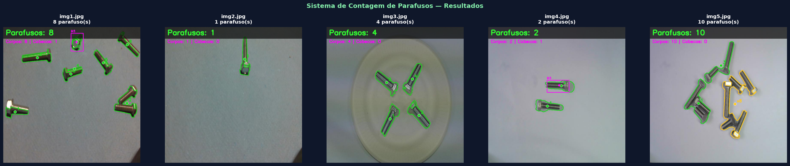
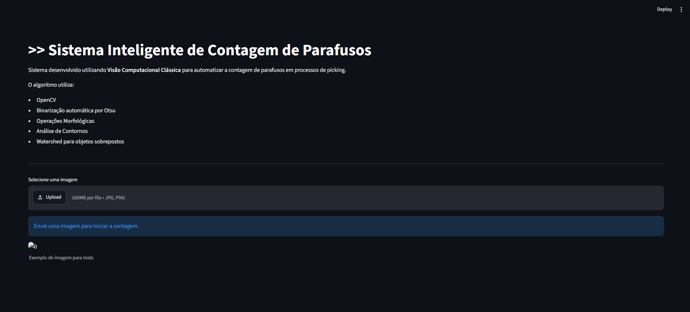
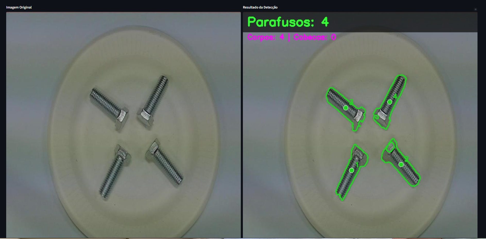
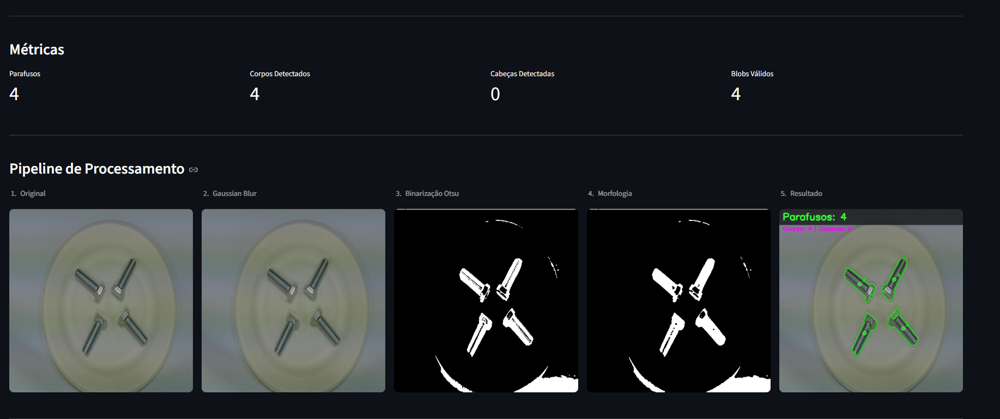
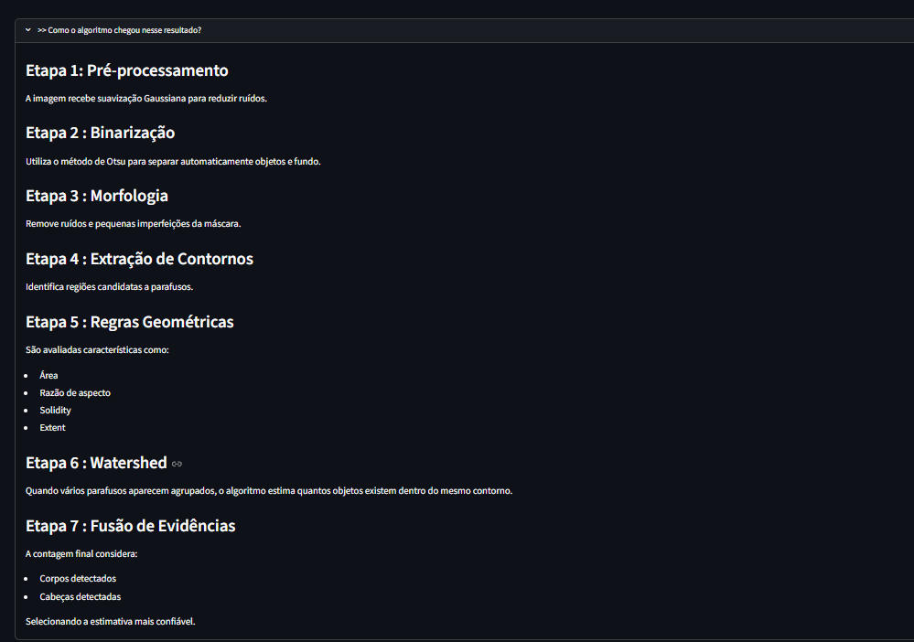

# Sistema Inteligente de Contagem de Parafusos



Solução desenvolvida para o **Desafio 1 – Contagem Automática de Parafusos**, utilizando técnicas de **Visão Computacional Clássica** com OpenCV.

O objetivo do projeto é automatizar a contagem de parafusos em cenários de picking e logística, reduzindo erros humanos e aumentando a eficiência operacional.

---

## Principais Características

* Segmentação automática por Otsu
* Operações morfológicas para limpeza da máscara
* Extração e análise de contornos
* Filtragem geométrica baseada em características dos objetos
* Tratamento de agrupamentos utilizando Watershed
* Aplicação Web desenvolvida com Streamlit
* Pipeline visual completo para auditoria dos resultados
* Avaliação quantitativa por métricas de desempenho

---

## Tecnologias Utilizadas

- Python 3.11+
- OpenCV
- NumPy
- Matplotlib
- Pandas
- Streamlit

---

## Arquitetura da Solução

```text
Imagem
   ↓
Redimensionamento
   ↓
Gaussian Blur
   ↓
Binarização Otsu
   ↓
Morfologia
   ↓
Extração de Contornos
   ↓
Filtros Geométricos
   ↓
Watershed Adaptativo
   ↓
Contagem Final
```

---

## Estrutura do Projeto

```text
contagem_parafusos/
│
├── app.py
├── main.py
├── requirements.txt
│
├── src/
│   ├── config.py
│   ├── detector.py
│   ├── visualization.py
│   └── metrics.py
│
├── data/
│   └── imgs/
│
├── results/
│
└── report/
    └── Sistema_Inteligente_de_Contagem_de_Parafusos.pdf
```

---

## Instalação

Clone o repositório:

```bash
git clone https://github.com/NaraAndrad3/coontagem_parafusos.git
cd coontagem_parafusos
```

Instale as dependências:

```bash
pip install -r requirements.txt
```

---

## Execução do Sistema

### Processamento em lote

```bash
python main.py
```

Resultados gerados:

```text
results/
├── result_img1.jpg
├── result_img2.jpg
├── pipeline_img1.png
├── pipeline_img2.png
├── summary_results.png
├── counts.json
└── avaliacao_metricas.csv
```

---

### Aplicação Web

Execute:

```bash
streamlit run app.py
```
## Demonstração

A aplicação web permite:

- Upload de imagens
- Visualização do pipeline completo
- Exibição das métricas
- Análise visual das etapas intermediárias

### Interface Inicial



### Resultado da Contagem



### Detalhes da Contagem



### Etapas intermediarias da Contagem



---

### Desempenho Obtido

O sistema foi avaliado utilizando as cinco imagens disponibilizadas pelo desafio.

| Imagem | Real | Predito |
|---------|------:|---------:|
| img1 | 8 | 8 |
| img2 | 1 | 1 |
| img3 | 4 | 4 |
| img4 | 2 | 2 |
| img5 | 10 | 10 |

Resultado: todas as contagens foram realizadas corretamente.

### Métricas

| Métrica  | Valor |
| -------- | ----: |
| Accuracy |  100% |
| MAE      |     0 |
| RMSE     |     0 |

---

##  Relatório Técnico

O relatório completo encontra-se em:

```text
report/Sistema_Inteligente_de_Contagem_de_Parafusos.pdf
```

Nele são detalhados:

* Fundamentação teórica
* Arquitetura da solução
* Metodologia
* Resultados experimentais
* Aplicação Web
* Limitações e trabalhos futuros

---

## Autora

**NaraAndrad3**
